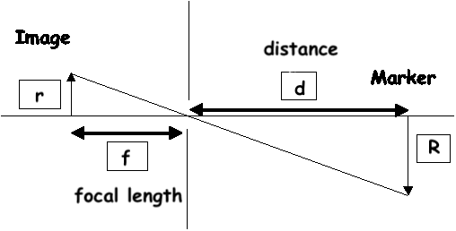

# Face-Measurement-Computation

This project is used to compute the distance from a known object in an image to our camera and also find the face measurements of user's face.

To accomplish this task we utilized the triangle similarity, which requires us to know two important parameters prior to applying our algorithm:

The width (or height) in some distance measure, such as Cm , of the object we are using as a marker.

The distance (in inches or meters) of the camera to the marker inititally to adjust the focal length of the camera.

Computer vision and image processing algorithms can then be used to automatically determine the perceived width/height of the object in pixels and complete the triangle similarity and give us our focal length.

Then, in subsequent images we simply need to find our marker/object and utilize the computed focal length to determine the distance to the object from the camera which in this case is a card on user's forehead.

Dependent Packages
numpy
OpenCV-Python
imutils
dlib
cv2
math
operator
and other packages like os,sys,glob

# How to Use

* clone the repo 
* add your pic directory from which the user selfie is obtained.The below image shows the sample of how input should be.

* add preictor path to the dlib's 68 face landmark detector

* Run the code in terminal.

# Basic Working 

The Idea of this method
The camera generates a one-to-one relationship between the object and the image. Using this principle, we can deduce a relationship between known parameters: focal length (f), radius of marker in the image plane (r), and radios of marker in the object plane (R) and unknown parameter, distance from the camera to the object(d).

Principle of the method

D’ = (W x F) / P

Using the principle of Similar Triangles, we can obtain the formulas as follows:

